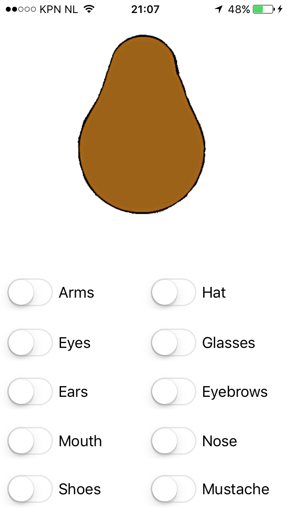
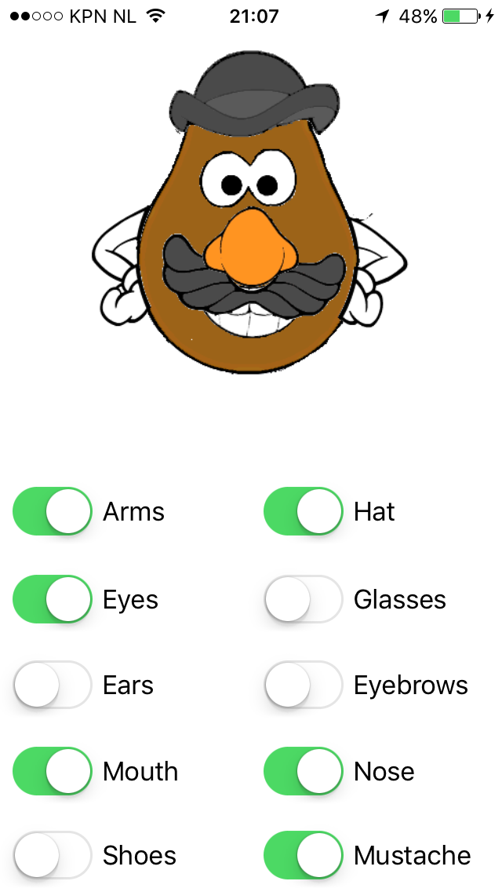
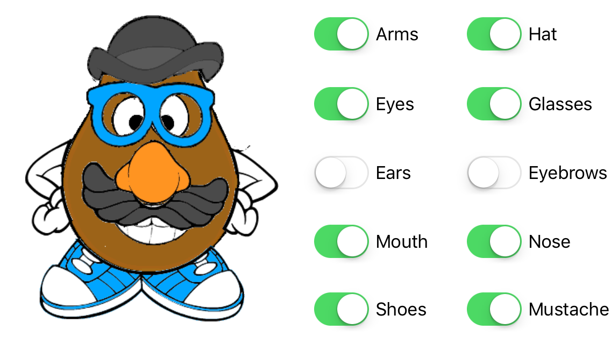

#Mr. Potato Head
This app displays initially just the body of mr. Potato Head. When you flick some of the switches below, the corresponding bodyparts will appear. Observe that one you tilt the screen, the layout of the app changes and everything still fits nicely on the screen.

